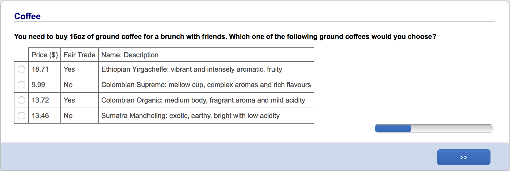

```{r setup, include=FALSE}
knitr::opts_chunk$set(echo = TRUE, fig.pos='H')
```

## A simple choice experiment

* $4 \times 40 = 160$ distinct participants

* "Which of the following colours do you like best"?

|Red|Purple|Pink|Total|
|---|------|----|-----|
| 19|    15|   6|   40|
| 21|    19|    |   40|
| 29|      |  12|   40|
|   |    37|   3|   40|

## Representing frequencies in Barycentric coordinates

```{r posterior, echo=FALSE, fig.align='center', fig.height=5, message=FALSE, warning=FALSE}
library(MASS)
library(klaR)
library(Smisc, quietly=TRUE)
source('R Simplices/simplex.R')

binary.pch=1
ternary.pch=20

triplot(label=c('Red', 'Purple', 'Pink'))

pxy = 21/40
pyx = 1-pxy
pxz = 28/40
pzx = 1-pxz
pyz = 37/40
pzy = 1-pyz
PTx = 19/40
PTy = 15/40
PTz = 6/40

# Sides of triangle
tripoints(pxy, pyx, 0.0, pch=binary.pch)
tripoints(0.0, pyz, pzy, pch=binary.pch)
tripoints(pxz, 0.0, pzx, pch=binary.pch)

text(tritrafo(pxy, pyx, 0.0), pos=2, "21 red, 19 purple")
text(tritrafo(0.0, pyz, pzy), pos=4, "37 purple, 3 pink")
text(tritrafo(pxz, 0.0, pzx), pos=1, "28 red, 12 pink")

# Interior
triperplines(PTx, PTy, PTz, pch=ternary.pch, lcol='grey')
text(tritrafo(PTx, PTy, PTz), pos=4, "19 red, 15 purple, 6 pink")
```

## An encompassing model

* $T$ is a finite universe of choice objects.

* $P_A(x)$ is the probability of choosing $x$ when presented with choice set $A$.

* A *random choice structure* for $T$ specifies $P_A(x)$ for all $x \in A \subseteq T$.

* For example, a random choice structure for $T \equiv \{\mathit{Red},\mathit{Purple},\mathit{Pink}\}$ gives four probability vectors:

$$ (P_T(\mathit{Red}), P_T(\mathit{Purple}), P_T(\mathit{Pink})) $$
$$ (P_{\{\mathit{Red},\mathit{Purple}\}}(\mathit{Red}), P_{\{\mathit{Red},\mathit{Purple}\}}(\mathit{Purple})) $$
$$ (P_{\{\mathit{Red},\mathit{Pink}\}}(\mathit{Red}), P_{\{\mathit{Red},\mathit{Pink}\}}(\mathit{Pink})) $$
$$ (P_{\{\mathit{Purple},\mathit{Pink}\}}(\mathit{Purple}), P_{\{\mathit{Purple},\mathit{Pink}\}}(\mathit{Pink})) $$

* The encompassing model: choices are mutually independent, governed by a static $P$.

## Random utility

A Random Utility Model (RUM) for $T$ is a probability space $(\Omega, {\cal F}, \mu)$
and a function $u \colon T \times \Omega \to \mathbb{R}$ such that
$$ x,y \in T,\, x\neq y \Rightarrow \mu(\{u(x,\omega) = u(y,\omega)\}) = 0. $$
A RUM *induces* an RCS through the construction
$$ P_A(x) = \mu(\{u(x,\omega) = \max_{y \in A} u(y,\omega)\}). $$

We say an RCS satisfies random utility if it can be induced by a RUM.

The content of RU is a kind of context invariance: $P$ does not depend on the choice set $A$: $P_{\{x,y,z\}}(x) > P_{\{x,y\}}(x)$ is impossible for a $P$ satisfying RU.

## Block-Marschak conditions

A random choice structure $P$ can be induced by a random utility model iff

$$ \forall x \in A \subseteq T,\; \sum_{B \colon A \subseteq B \subseteq T} (-1)^{|B \backslash A|} P_B(x) \geq 0. $$
Notes:

1. Each $P_A(x)$ features in multiple sums.
1. Region is convex (intersection of half planes).
1. Block and Marschak show necessity; Falmagne (1978), sufficiency.

## Random utility and context dependence

* EBA models (Tversky, 1972) describe choice from $A$ as a stochastic procedure of sequential elimination, and yet they satisfy EBA.

* Random Regret Model (Chorus, 2010) satisfies random utility for some values of the parameters.

* So-called context effects not all inconsistent with random utility
    * Similarity and compromise effects are *consistent* with random utility.
    * Asymmetric dominance effect is inconsistent with random utility.

## Main objective

* Testing random utility, no more and no less
    * Minimal additional assumptions.
    * Collect data for all subsets of a universe with at least two elements, to expose all implications of random utility to possible falsification.

## Other conditions we test

1. Weak, Moderate and Strong Stochastic Transitivity

1. Triangle Inequality
    * Necessary for regularity

1. Regularity
    * Necessary for random utility
    
1. Multiplicative Inequality
    * Necessary for Elimination By Aspects (EBA, Tversky 1972)
    * Necessary for independent random utility

## A testing ground for axioms of stochastic discrete choice

Definitions:

* $\Delta$ is the space of random choice structures.
* $\Lambda \subseteq \Delta$ is the region where random utility (or some other condition) holds.
* $Y$ is chioce data, $y$ the observed (realized) data.

Testing ground consists of

1. (McCausland and Marley, 2013) A two-parameter family of prior distrubutions
    * $\alpha$ (marginals)
    * $\lambda$ (degree of dependence across choice sets)
1. (McCausland and Marley, 2014) Simulation methods to compute approximations of
    * $\Pr[P \in \Lambda]$,
    * $\Pr[P \in \Lambda|Y=y]$,
    * standard errors.

## A test using Bayes factors

The Bayes factor in favour of a restricted model in which the axiom holds, against the encompassing model, is
$$ \mathrm{BF} \equiv \frac{\Pr[Y=y|P \in \Lambda]}{\Pr[Y=y]} = \frac{\Pr[P \in \Lambda|Y=y]}{\Pr[P \in \Lambda]}. $$

If the two models are *a-priori* equiprobable, BF is posterior odds ratio (ratio of posterior probabilities).

```{r simplex, echo=FALSE, fig.align='center', fig.height=5, message=FALSE, warning=FALSE}
r.quantile <- function(alpha, beta, normalized=FALSE) {
  ld.max = max.d.Di(beta, log=TRUE)
  m = exp(mu.d.Di(beta, 2, log=TRUE) - c(1,2)*ld.max)
  r = m[2]/m[1]
  den = r*(1-m[1]) - m[1]*(1-r)
  theta1 = m[1]*(1-r)/den;
  theta2 = (1-m[1])*(1-r)/den
  q = qbeta(alpha, theta1, theta2)
  if (normalized) q else q * exp(ld.max)
}

f.Di <- function(p1, p2, beta, log=FALSE) {
  # Compute log normalization constant
  ln.f = lgamma(sum(beta)) - sum(lgamma(beta))
  # Compute the complementary probability p3, then evaluate the log density kernel
  # Guard against complex values due to p1+p2>1 by taking max with 0.
  p3 = pmax(0, 1-p1-p2)
  ln.f = ln.f + (beta[1]-1)*log(p1) + (beta[2]-1)*log(p2) + (beta[3]-1)*log(p3)
  if (log) ln.f else exp(ln.f)
}

max.d.Di <- function(beta, log=FALSE) {
  # Compute normalization constant
  ln.d.max = lgamma(sum(beta)) - sum(lgamma(beta))
  # Compute log density kernel at mode
  ln.d.max = ln.d.max + sum((beta-1)*log(beta-1))
  ln.d.max = ln.d.max - (sum(beta)-length(beta))*log(sum(beta)-length(beta))
  if (log) ln.d.max else exp(ln.d.max)
}

mu.d.Di <- function(beta, n.mu, log=FALSE) {
  ln.common = lgamma(sum(beta)) - sum(lgamma(beta))
  log.mu = rep(0, n.mu);
  for (j in 1:n.mu) {
    ln.j.factor = sum(lgamma((j+1)*beta-j))
    ln.j.factor = ln.j.factor - lgamma((j+1)*sum(beta)-length(beta)*j)
    log.mu[j] = (j+1)*ln.common + ln.j.factor
  }
  if (log) log.mu else exp(log.mu)
}

# Plot HPD in barycentric coordinates
alpha = 2 # McCausland and Marley parameter
beta = c(19+alpha/3, 15+alpha/3, 6+alpha/3)
p1 <- p2 <- seq(0, 1, by=0.001) # Grid of points
f <- outer(p1, p2, FUN=f.Di, beta) # Evaluation on grid
q.d = r.quantile(0.05, beta, FALSE)
cl = contourLines(p1, p2, f, levels = q.d) # Contour for beta approximation
#tripl = triplot(label=c('Red', 'Purple', 'Pink'))
#polygon(tritrafo(cl[[1]]$x, cl[[1]]$y), col='lightgreen')
#tripoints(PTx, PTy, PTz, pch=ternary.pch)

# Plot binary probability HPD intervals on sides of triangle
# Left side: suppose (p1, p2) ~ Be(21+alpha/2, 19+alpha/2)
int <- hpd(function(x) dbeta(x, 21+alpha/2, 19+alpha/2), c(0, 1), cdf = function(x) pbeta(x, 21+alpha/2, 19+alpha/2), prob=0.95)
#lines(tritrafo(c(int$lower, int$upper), c(1-int$lower,1-int$upper)), lwd=4)
# Right side: suppose (p2, p3) ~ Be(37+alpha/2, 3+alpha/2)
int <- hpd(function(x) dbeta(x, 37+alpha/2, 3+alpha/2), c(0, 1), cdf = function(x) pbeta(x, 37+alpha/2, 3+alpha/2), prob=0.95)
#lines(tritrafo(c(0,0), c(int$lower,int$upper)), lwd=4)
# Bottom side: suppose (p1, p3) ~ Be(28+alpha/2, 12+alpha/2)
int <- hpd(function(x) dbeta(x, 28+alpha/2, 12+alpha/2), c(0, 1), cdf = function(x) pbeta(x, 28+alpha/2, 12+alpha/2), prob=0.95)
#lines(tritrafo(c(int$lower, int$upper), c(0,0)), lwd=4)
#tripoints(pxy, pyx, 0.0, pch=binary.pch)
#tripoints(0.0, pyz, pzy, pch=binary.pch)
#tripoints(pxz, 0.0, pzx, pch=binary.pch)
```

## Two posterior distributions

* Two different priors with the same four marginals:
    * left, $\lambda=0$, independence across choice sets
    * right, $\lambda=1$, support is random utility region.

* Each panel shows four 95\% High Probability Density regions

```{r scatter, echo=FALSE, message=FALSE, warning=FALSE}
t = read.table('~/Results/RCM_population/population_colour3')
op = par(mfrow=c(1, 2), mar = c(4, 4, 0.5, 0.5))
tripl = triplot(label=c('Red', 'Purple', 'Pink'))
polygon(tritrafo(cl[[1]]$x, cl[[1]]$y), col='lightgreen')
tripoints(PTx, PTy, PTz, pch=ternary.pch)
# Left side
int <- hpd(function(x) dbeta(x, 21+alpha/2, 19+alpha/2), c(0, 1), cdf = function(x) pbeta(x, 21+alpha/2, 19+alpha/2), prob=0.95)
lines(tritrafo(c(int$lower, int$upper), c(1-int$lower,1-int$upper)), lwd=4)
# Right side: suppose (p2, p3) ~ Be(37+alpha/2, 3+alpha/2)
int <- hpd(function(x) dbeta(x, 37+alpha/2, 3+alpha/2), c(0, 1), cdf = function(x) pbeta(x, 37+alpha/2, 3+alpha/2), prob=0.95)
lines(tritrafo(c(0,0), c(int$lower,int$upper)), lwd=4)
# Bottom side: suppose (p1, p3) ~ Be(28+alpha/2, 12+alpha/2)
int <- hpd(function(x) dbeta(x, 28+alpha/2, 12+alpha/2), c(0, 1), cdf = function(x) pbeta(x, 28+alpha/2, 12+alpha/2), prob=0.95)
lines(tritrafo(c(int$lower, int$upper), c(0,0)), lwd=4)
tripoints(pxy, pyx, 0.0, pch=binary.pch)
tripoints(0.0, pyz, pzy, pch=binary.pch)
tripoints(pxz, 0.0, pzx, pch=binary.pch)

tripl = triplot(label=c('Red', 'Purple', 'Pink'))
#tripoints(t$P1, t$P2, pch=ternary.pch) # Scatterplot
a = c(0.2, 0.1)
b = c(0.8, 0.7)
n = c(100,100)
h = (b-a)/n
kde = kde2d(t$P1, t$P2, lims = c(a[1], b[1], a[2], b[2]), h=0.05, n=n)
al.est = sum(h[1]*h[2]*kde$z*(kde$z < 3.65))
q = quantile(t$p12, c(0.025, 0.975))
lines(tritrafo(c(q[[1]], q[[2]]), c(1-q[[1]],1-q[[2]])), lwd=4)
q = quantile(t$p23, c(0.025, 0.975))
lines(tritrafo(c(0,0), c(q[[1]],q[[2]])), lwd=4)
q = quantile(t$p13, c(0.025, 0.975))
lines(tritrafo(c(q[[1]], q[[2]]), c(0,0)), lwd=4)
tripoints(pxy, pyx, 0.0, pch=binary.pch)
tripoints(0.0, pyz, pzy, pch=binary.pch)
tripoints(pxz, 0.0, pzx, pch=binary.pch)

cl = contourLines(kde, levels = 3.65) # Contour for beta approximation
polygon(tritrafo(cl[[1]]$x, cl[[1]]$y), col='lightgreen')
tripoints(PTx, PTy, PTz, pch=ternary.pch)
```

## Two experiments

1. McCausland et al. "Testing the Random Utility Hypothesis Directly" (accepted, EJ)
    * Repeated individual choice
    * 141 subjects
    * Universe is five simple lotteries, similar to Tversky (1969), "Intransitivity of Preferences"
    * 6 trials each of 26 doubleton and larger subsets of five lotteries
    * Strong support for hypothesis that most, but not all subjects

1. McCausland et al. "Testing axioms of stochastic discrete choice using population choice probabilities" (incomplete and preliminary).
    * Population choice
    * 1040 subjects
    * 32 choice domains, each a universe of five choice objects

## Experimental design, population choice experiment

We ran an experiment with these features:

1. 32 different choice domains (consumer choice, taste, judgement)
    - Trying to say something general about choice.

1. Strictly between-subject design for each choice domain
    - No subject sees the same domain twice.
    - Choices are plausibly independent (globally) and identically distributed (choice set by choice set).

1. Collect choice data for *all* subsets with at least two elements of a universe of objects.
    - Each choice set of each domain presented to 40 different subjects. 
    - Expose *all* implications of random utility (and other conditions) to possible falsification.

## A consumer choice example



## A simple taste example


## A judgement example


## A visual example


## Assignment of subjects to choice sets


## Log Bayes factors, first 16 domains

```{r pr.table, echo=FALSE, fig.height=5, fig.align='center'}
domain.names = c(
  'Prior',
	'Male stars',           # 1
	'Female stars',
	'Films',
	'Star pairs',
	'Pizzas',               # 5
	'Juices',
	'Colours',
	'Colour Combinations',
	'Events',
	'Radio formats',        # 10
	'Musical artists',
	'Aboriginal art',
	'Impressionist art',
	'Sentences',
	'Travel',               # 15
	'Marijuana',
	'Latitude',
	'Dots',
	'Triangles',
	'Population',           # 20
	'Surface area',
	'Beer',
	'Cars',
	'Restaurants',
	'Flight layovers',      # 25
	'Future payments',
	'Phone plans',
	'Hotel rooms',
	'Two-flight itineraries',
	'Televisions',          # 30
	'Coffee',
	'Charity')

result.table = read.table('Tables/population_single_model.txt')
row.names(result.table) = domain.names
alpha.table = result.table[,c('alpha0.05est', 'alpha0.25est', 'alpha0.50est', 'alpha0.75est', 'alpha0.95est')]
lambda.table = result.table[,c('lambda0.05est', 'lambda0.25est', 'lambda0.50est', 'lambda0.75est', 'lambda0.95est')]
BF.table = result.table[,c('wst.lnBF', 'mst.lnBF', 'sst.lnBF', 'reg.lnBF', 'ru.lnBF', 'mul.lnBF')]
knitr::kable(BF.table[2:17,], col.names = c('WST','MST','SST','Reg','RU','MI'), digits = c(1,1,1,1,1))
```

## Log Bayes factors, other 16 domains

```{r BF.table, echo=FALSE, fig.height=5, fig.align='center'}
knitr::kable(BF.table[18:33,], col.names = c('WST','MST','SST','Reg','RU','MI'), digits = c(1,1,1,1,1))
```

## Conclusions

Conclusions

1. For each choice domain, evidence favours random utility.
1. Overall evidence in favour of random utility is compelling.

Future work

1. Prior as model
    * Support goes beyond RU region, but in a disciplined way.
    * Discriminate within the random utility region.
